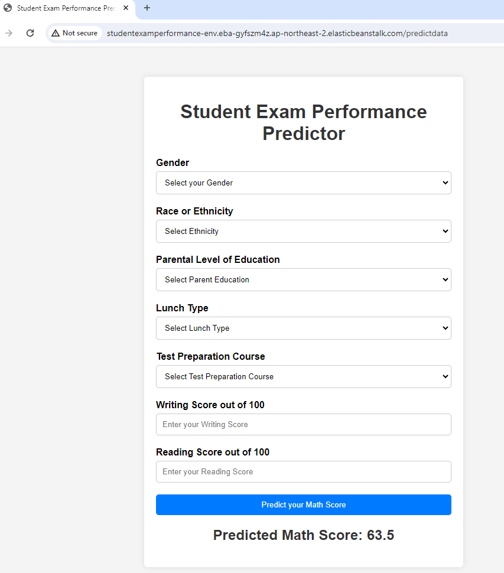

## A simple machine learning project

### Dataset Introduction

The goal is to predict the math score of a student based on other given values.

There are 7 different input variables:
1. Gender
2. Race/Ethnicity
3. Parental Education
4. Lunch 
5. test preparation course
6. Reading Score
7. Writing Score

Target Variable:
2. Math Score

### How to run? 
1. Clone the repository
https://github.com/ranalila98/ML-Project-

2. Creat a conda env
conda create -n venv python=3.8 -y
conda activate cnncls/

3. Install the requirements
pip install -r requirements.txt

4. Data Ingestion 
python src/components/data_ingestion.py

5. Finally, run the following command
python app.py

6. Now, open up you local host and port

### Aproach of this work

Data Ingestion :

In Data Ingestion phase the data is first read as csv.
Then the data is split into training and testing and saved as csv file.

Data Transformation :

In this phase a ColumnTransformer Pipeline is created. For Numeric Variables first SimpleImputer is applied with strategy median , then Standard Scaling is performed on numeric data.
For Categorical Variables SimpleImputer is applied with most frequent strategy, then ordinal encoding performed , after this data is scaled with Standard Scaler.

This preprocessor is saved as pickle file.

Model Training :

In this phase base model is tested . The best model found was Linear regressor by comparing with other algorithms and hyperparameter tuning. 

This model is saved as pickle file.

Prediction Pipeline :

This pipeline converts given data into dataframe and has various functions to load pickle files and predict the final results in python.

Flask App creation :

Flask app is created with User Interface to predict the Math score of a student inside a Web Application.

